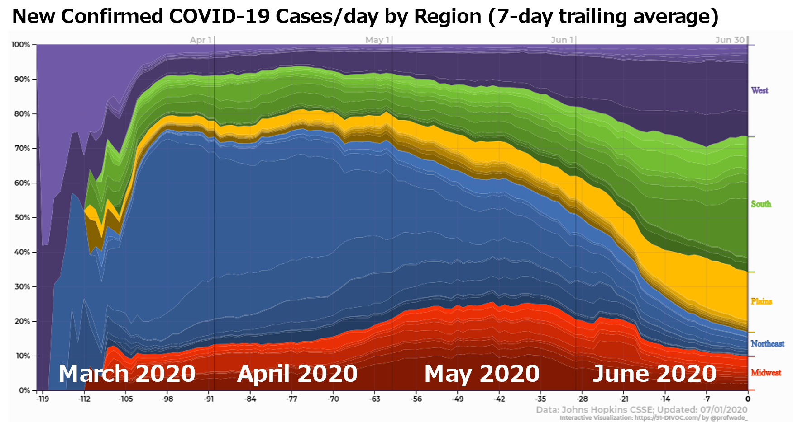

---
---

# July 1, 2020 -- Four Months of COVID-19

## Feature Update: CSV Export

Earlier today, a small feature was added to the visualization of COVID-19 data by countries/states to save all displayed data and export it as a CSV file.  You can find "CSV" listed next to the "PNG" and "SVG" export options below each graph:

## A Few Interesting Bits: Four Months of COVID-19

Using the latest visualization, [https://91-divoc.com/pages/coronavirus-contribution-by-state/]("Coronavirus Contribution by State"), you can view each state's contribution towards COVID-19 in the United States.  I find the varied views really interesting, each offering different insight on the progression of the pandemic.

### March 2020

March 2020 was the month that COVID-19 took hold in the United States -- growing from only a few cases in early March to a then-record-high of 26,011 new confirmed cases on March 31.  By the end of March, 60% of all daily new confirmed cases were consistently reported in the Northeast with the greater New York city area reporting over 50% of the cases:

